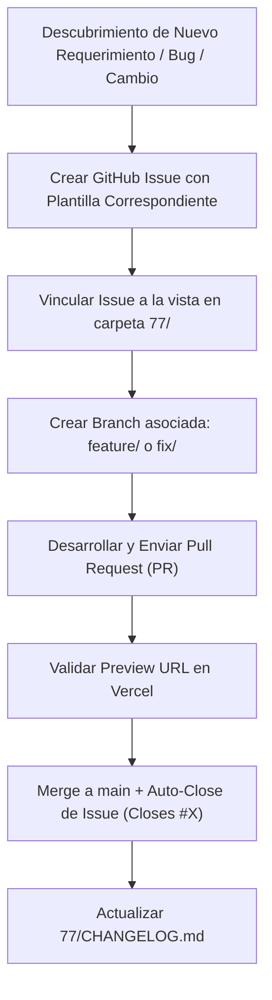

# 77 STUDIO - Gobernanza Técnica, Control de Versiones & DevOps

> **Propósito:** Definir los estándares de ingeniería de software, arquitectura de decisiones, flujo de trabajo en GitHub, despliegue continuo en Vercel, gestión de cambios/imprevistos y versionado semántico para el ecosistema web de **77 Studio**.

---

## 1. Estrategia de Ramas: Delegación en 3 Niveles (Feature -> Develop -> Main)

Adoptamos una arquitectura de ramas estricta en 3 niveles para proteger la estabilidad de producción y garantizar la supervisión humana (*Human-in-the-loop*):

```
[Trabajo por /goal en Feature Branch]
        │
        ▼
   feature/xxx  ─────► Push a origin feature/xxx
        │
        ▼
   [Human in the Loop Review]
        │
        ▼
   develop (Staging Environment - Vercel Preview)
        │
        ▼
   [Validación Final y Pruebas QA]
        │
        ▼
   main (Producción)
```

### Descripción de Niveles:

1. **Nivel 1 - Ramas de Objetivo / Característica (`feature/<nombre-objetivo>`):**
   - Cada vez que un agente o desarrollador comience a trabajar en una característica, hito o meta (ej. iniciada con el comando `/goal`), debe crear obligatoriamente una nueva rama aislada: `git checkout -b feature/<nombre>`.
   - Queda **estrictamente prohibido** commitear directamente sobre `develop` o `main`.
   - Al finalizar el desarrollo y verificar que la característica está completa, se realiza el push a origin: `git push -u origin feature/<nombre>`.

2. **Nivel 2 - Rama Staging (`develop`) - Human-in-the-loop:**
   - Representa el entorno de integración y pruebas previas (Staging).
   - El desarrollador o líder técnico (*Human-in-the-loop*) revisa el Pull Request o cambios de la rama `feature/*` y autoriza el merge a `develop`.
   - Vercel compila automáticamente un despliegue de Staging a partir de `develop`.

3. **Nivel 3 - Rama Producción (`main`):**
   - Representa el código en producción oficial.
   - Solo cuando los cambios en `develop` han sido validados de forma integral, probados y aprobados, se ejecuta el merge final de `develop` hacia `main`.

---

## 2. Convención de Commits: Conventional Commits

Todos los desarrolladores e inteligencias artificiales que contribuyan al repositorio deben seguir el estándar **Conventional Commits 1.0.0**:

```
<tipo>(<ámbito opcional>): <descripción corta en presente e imperativo>

[cuerpo opcional explicativo]

[pie de página opcional: Closes #123]
```

### Tipos de Commit Permitidos

| Tipo | Propósito | Ejemplo | Impacto en SemVer |
|---|---|---|---|
| `feat` | Nueva característica o vista | `feat(home): add interactive capability grid` | **MINOR** (`vX.Y.0`) |
| `fix` | Corrección de un error o fallo | `fix(cta): repair prefilled WhatsApp link scope` | **PATCH** (`vX.X.Z`) |
| `docs` | Cambios en documentación | `docs(governance): add vercel deployment protocol` | N/A |
| `style` | Formato, espacios, CSS (sin cambio funcional) | `style(cards): adjust border radius to rounded-[20px]` | **PATCH** |
| `refactor` | Reestructuración de código sin alterar comportamiento | `refactor(header): extract nav items into constant` | N/A |
| `perf` | Mejoras de rendimiento o carga | `perf(images): convert png assets to webp` | **PATCH** |
| `chore` | Tareas de compilación, dependencias o tooling | `chore(deps): upgrade astro to v5.2.0` | N/A |
| `BREAKING CHANGE` | Cambio incompatible con versión previa | `feat(api)!: change contact form payload schema` | **MAJOR** (`vX.0.0`) |

---

## 3. Infraestructura & Despliegue Continuo (CI/CD)

### Frontend (Vercel)
- **Producción:** Despliegue automático cada vez que un Pull Request es aprobado y unido (`merged`) a la rama `main`.
- **Previews (Staging):** Vercel genera automáticamente un enlace de vista previa interactivo (*Preview URL*) para **cada Pull Request**. Esto permite validar el sitio visualmente antes de fusionarlo.

### Microservicios / Backend Interno (Dokploy)
- Para servicios complementarios de 77 Studio (automations, n8n, webhooks de CRM, bases de datos o servicios de IA alojados en servidores propios), la gestión de contenedores se realiza mediante **Dokploy**.
- Las variables de entorno de frontend en Vercel (`PUBLIC_API_URL`, etc.) apuntan a los endpoints orquestados en Dokploy.

---

## 4. Gestión de Tareas, Imprevistos y Cambios en GitHub

Para llevar un control estricto de cualquier actualización, adición no planeada o ajuste por error de comunicación, utilizaremos **GitHub Issues + GitHub Projects**.

### Flujo de Trabajo para Imprevistos y Updates



### Plantillas de Issues Requeridas

1. **Bug Report (`fix`):** Descripción del fallo, comportamiento esperado, captura/preview URL y severidad.
2. **Feature Request (`feat`):** Especificación del módulo nuevo, objetivo comercial y subcarpeta impactada en `77/`.
3. **Scope Change / Communication Update (`change`):** Ajuste de requerimientos solicitados por el cliente o equipo comercial que no estaban contemplados originalmente. Permite documentar el "por qué" y el impacto en la arquitectura.

---

## 5. Proceso de Decisión Tecnológica (ADRs)

Cuando se tome una decisión estructural relevante (ej. cambiar una librería de animaciones, integrar un Headless CMS, seleccionar un paquete de formateo de formularios), se debe crear un **Architecture Decision Record (ADR)** en `77/adr/` siguiendo el formato Nygard:

```
77/adr/
├── 0001-uso-de-astro-5-y-mdx.md
├── 0002-tailwind-v4-y-tokens-css.md
└── 0003-vercel-deployment-strategy.md
```

### Estructura de un ADR:
- **Título:** `ADR-XXXX: [Nombre de la decisión]`
- **Estatus:** Proposed | Accepted | Deprecated | Superseded
- **Contexto:** ¿Qué problema estamos resolviendo?
- **Decisión:** ¿Qué tecnología o patrón elegimos y por qué?
- **Consecuencias:** Beneficios, riesgos o compromisos asumidos.

---

## 6. Versionado Semántico (SemVer 2.0.0)

El proyecto **77 Studio Web** sigue el esquema de versión **`MAJOR.MINOR.PATCH`**:

- **`MAJOR` (v1.0.0, v2.0.0):** Rediseño total de arquitectura, cambio completo de stack o reestructuración masiva de branding/routing.
- **`MINOR` (v1.1.0, v1.2.0):** Lanzamiento de nuevos módulos o páginas enteras (ej. publicación de la vista `/ia-automatizacion` o un nuevo producto digital).
- **`PATCH` (v1.0.1, v1.0.2):** Correcciones de bugs, parches visuales, actualización de textos copy/CRO o mejoras de accesibilidad/rendimiento.

### Flujo de Release
1. Al acumular cambios significativos o completar un hito del `ROADMAP.md`, se actualiza `77/CHANGELOG.md`.
2. Se crea un Git Tag en GitHub:
   ```bash
   git tag -a v1.0.0 -m "Release v1.0.0 - Lanzamiento Oficial de 77 Studio"
   git push origin v1.0.0
   ```
3. Se publica un **GitHub Release** formal adjuntando las notas del Release desde `CHANGELOG.md`.

---

## 8. Uso Obligatorio de la CLI de Agentes (`npm run 77`) & Skill `77-commit-and-docs`

Todo desarrollador o agente de IA que realice adiciones de propiedades, nuevos componentes o modificaciones en el core debe utilizar la skill `.agents/skills/77-commit-and-docs/SKILL.md` y la CLI oficial del proyecto:

```bash
# Reconstruir la base de conocimiento JSON para el Agente de IA Chat (RAG)
npm run 77 knowledge

# Ejecutar commit estandarizado y actualizar CHANGELOG.md automáticamente
npm run 77 commit

# Inspeccionar el estado de la arquitectura y módulos documentados
npm run 77 inspect
```

